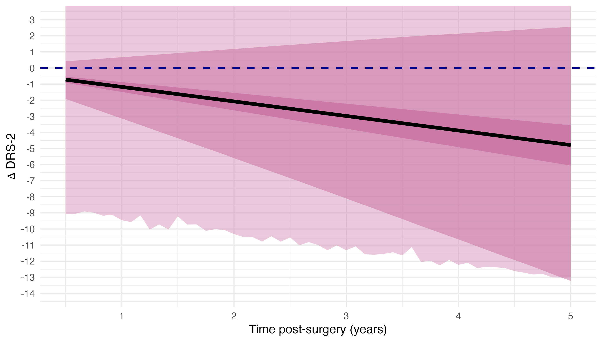
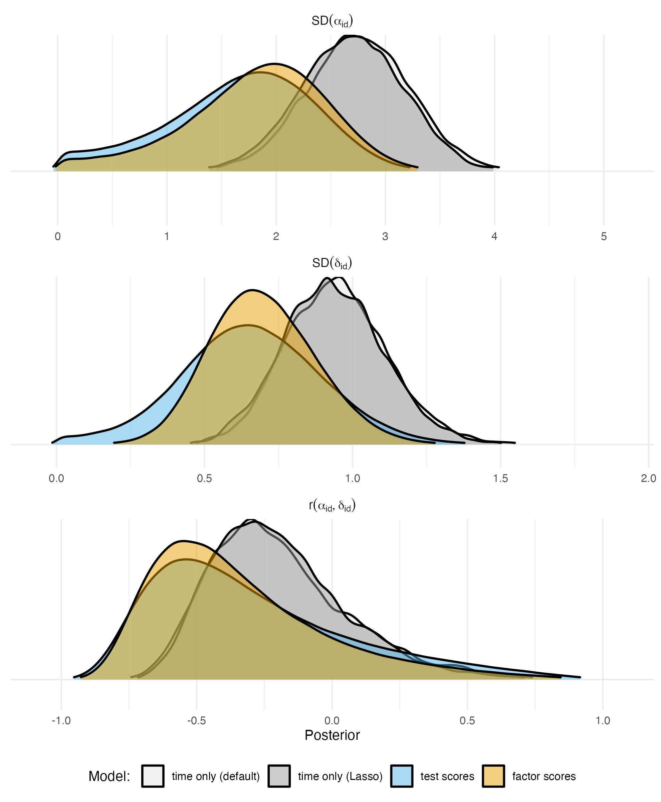
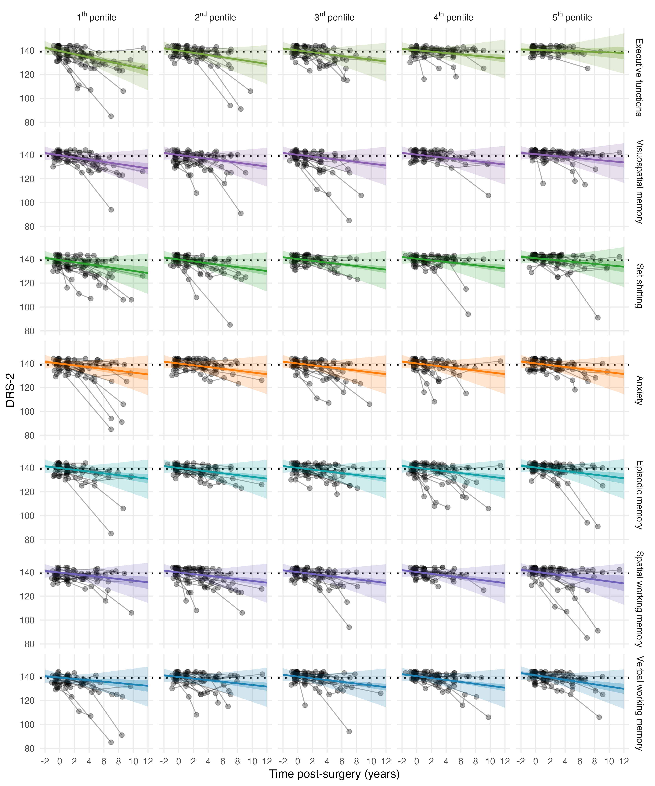

# Predicting Cognition after Bilateral Deep Brain Stimulation of Subthalamic Nucleus Surgery in Parkinson's Disease

In this project, I aim to describe long-term changes in global cognitive ability of patients with Parkinson's disease (PD) treated via bilateral deep brain stimulation (DBS) of subthalamic nuclei (STN) as a function of time (the "descriptive" or "time only" portion of the manuscript) as well as a function of time and more granular pre-surgery cognitive profile (the "predictive" or "factor scores" portion of the manuscript).

The data that support findings of this study are not publicly available due institutional regulations protecting patient clinical information but are available from the me on request (may require data use agreements to be developed). I will gladly welcome anyone to the lab and let them cruise through the data and models. Where possible, I shared analysis code, model posteriors, and synthetic data (I could have missed some opportunities for transparency though, if you have ideas how to make the project more open, let me know).

The *[renv](https://rstudio.github.io/renv/)* package was used to create reproducible environment for the project. To set-up R environment for reproduction of our results, run:

```
install.packages("renv")
renv::restore()
```

## Research Questions

| Research question                                                                                                                        |                                                                                                                                                   Estimand (unit specific quantity)                                                                                                                                                   |      Estimand (population)     |                                Statistical estimator                               |
|------------------------------------------------------------------------------------------------------------------------------------------|:-------------------------------------------------------------------------------------------------------------------------------------------------------------------------------------------------------------------------------------------------------------------------------------------------------------------------------------:|:------------------------------:|:----------------------------------------------------------------------------------:|
| What is the size of expected long-term rate of cognitive decline after STN DBS in PD patients?                                           |                                                                                                            Difference between expected post-surgery cognitive performance and expected cognitive performance *k* years before                                                                                                           |         Current sample         |                              $\mu_i$ = $\alpha$ + $\delta_{time}time_i$                             |
|                                                                                                                                          |                                                                                                                                                                                                                                                                                                                                       | CAPSIT-based selected patients |       $\mu_i$ = $\alpha$ + $\delta_{time}time_i$ + $\alpha_{id[i]}$ + $\delta_{id[i]}time_i$        |
| What is the pre-surgery cognitive profile that is predictive of long-term post-surgery cognitive decline in STN DBS treated PD patients? | Difference between expected post-surgery cognitive decline of a patient with fixed level of pre-surgery performance across all cognitive factors and expected post-surgery cognitive decline of patients with performance that is one unit smaller in a single cognitive factor but equal to this patient’s performance otherwise |         Current sample         | $\mu_i$ = $\alpha$ + $\delta_{time}time_i$ + $\sum_j ($\beta_{factor[j]}factor_{[j]i}$ + $\delta_{factor[j]}time_ifactor_{[j]i}$)$ |

## Reasearch Answers

Computing average linear post-surgery decline in Mattis Dementia Rating Scale (DRS-2) via Generalised Linear Mixed models with group-level and patient-level intercepts and slopes with Student-t measurement error assumption fitted via *[brms](https://paul-buerkner.github.io/brms/)* package ended up with estimates of relatively small and gradual average post-surgery (black line) decline with high inter-individual heterogeneity as well as substantial measurement error (shades represent predictions of change scores via 'fixed-effects', 'fixed- & random-effects', and full model 90% [ETIs](https://easystats.github.io/bayestestR/articles/credible_interval.html)):



Adding group-level predictors in form of pre-surgery cognitive factor/test scores resulted in some reduction of patient-level variability compared to the "time only" descriptive model while keeping posterior predictions for included very similar.



Most notably, patients with better pre-surgery executive functions had lower post-surgery rate of cognitive decline in DRS-2. In the following plot, each row includes all patient stratified to pentiles (from the lowest to highest performance) according to their pre-surgery cognitive performance in domain listed on right (the domains are colour coded based on their similarity to each other according to my judgement):


